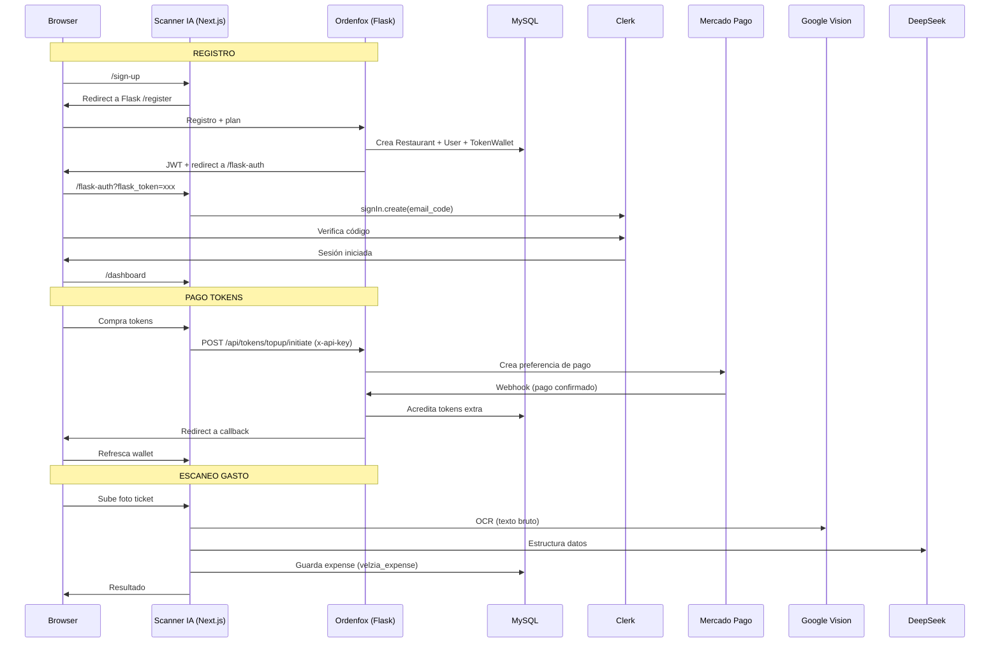

# Arquitectura General — Velzia

> **Versión:** 1.0 | **Fecha:** 2026-06-10

## Diagrama de Alto Nivel

```mermaid
graph TB
    subgraph "Clientes"
        C[Cliente en Mesa]
        M[App Móvil / API]
    end

    subgraph "Velzia - Ordenfox Flask"
        FL[Flask App<br/>:5000]
        SRV[Service Layer<br/>8 servicios]
        DB[(MySQL<br/>orderfox)]
        TM[Templates Jinja2]
    end

    subgraph "Velzia - Scanner IA Next.js"
        NX[Next.js App<br/>:3000]
        PR[Prisma ORM]
        CL[Clerk Auth]
    end

    subgraph "Servicios Externos"
        CV[Google Vision API]
        DS[DeepSeek AI]
        MP[Mercado Pago]
        CK[Clerk OAuth]
        CN[Cloudinary]
    end

    C -- QR Code --> FL
    C -- HTTPS --> NX
    M -- JWT --> FL
    
    FL -- Service Layer --> SRV
    SRV -- SQLAlchemy --> DB
    NX -- Prisma --> DB
    
    NX -- REST --> FL
    FL -- S2S x-api-key --> NX
    
    FL -- Uploads --> CN
    FL -- Payments --> MP
    FL -- Email --> Gmail SMTP
    
    NX -- OCR --> CV
    NX -- Structuring --> DS
    NX -- Auth --> CK
    FL -- Auth --> CK

    style FL fill:#f97316,color:#fff
    style NX fill:#7c3aed,color:#fff
    style DB fill:#2563eb,color:#fff
    style CK fill:#000,color:#fff
```

## Stack Tecnológico

| Capa | Ordenfox (Flask) | Scanner IA (Next.js) |
|------|-----------------|---------------------|
| **Framework** | Flask 3.x | Next.js 15 (App Router) |
| **Lenguaje** | Python 3 | TypeScript 5 |
| **Frontend** | Jinja2 + Vanilla JS | React 19 + Tailwind v4 |
| **ORM** | SQLAlchemy + Alembic | Prisma 7 |
| **BD** | MySQL 8 (pymysql) | MySQL 8 (MariaDB adapter) |
| **Auth** | Clerk + JWT + Sesión | Clerk |
| **Pagos** | Mercado Pago SDK | Proxy via Flask |
| **OCR** | — | Google Vision API |
| **AI** | — | DeepSeek API |
| **Imágenes** | Cloudinary | Local uploads |
| **Jobs** | APScheduler | — |
| **Rate Limit** | Flask-Limiter | — |

## Flujo de Datos entre Apps



## Estructura de Directorios

```
/Orderfox/                          # Flask App
├── app/
│   ├── routes/                     # 16 blueprints (web + API)
│   │   ├── auth.py                 # Web auth (login, register, payment)
│   │   ├── dashboard.py            # Dashboard web
│   │   ├── categories.py           # CRUD categorías web
│   │   ├── products.py             # CRUD productos web
│   │   ├── orders.py               # Gestión pedidos web
│   │   ├── public.py               # Menú público (QR)
│   │   ├── menu.py                 # Búsqueda pública
│   │   ├── tables.py               # Mesas web
│   │   ├── tokens.py               # API tokens (JWT/session/api-key)
│   │   ├── api_auth.py             # API auth (JWT)
│   │   ├── api_dashboard.py        # API dashboard
│   │   ├── api_categories.py       # API categorías
│   │   ├── api_products.py         # API productos
│   │   ├── api_orders.py           # API pedidos
│   │   ├── api_public.py           # API menú público
│   │   └── api_tables.py           # API mesas
│   ├── services/                   # Service layer (8 módulos)
│   │   ├── auth_service.py
│   │   ├── order_service.py
│   │   ├── product_service.py
│   │   ├── category_service.py
│   │   ├── dashboard_service.py
│   │   ├── public_menu_service.py
│   │   ├── table_service.py
│   │   └── token_service.py
│   ├── models.py                   # SQLAlchemy ORM
│   ├── utils/
│   │   ├── subscription.py         # Planes, límites, features
│   │   ├── jwt_auth.py             # Decoradores JWT
│   │   ├── auth.py                 # Decoradores sesión
│   │   ├── rate_limiter.py         # Anti-spam
│   │   └── image_handler.py        # Cloudinary uploads
│   ├── extensions.py               # Mail + APScheduler
│   ├── csrf.py                     # CSRFProtect
│   └── tasks.py                    # Jobs programados
├── template/                       # Jinja2 templates
└── tests/                          # Tests Python

/Receipt-Scanner-AI/                # Next.js App
├── src/
│   ├── app/
│   │   ├── page.tsx                # Landing
│   │   ├── layout.tsx              # Root layout
│   │   ├── middleware.ts           # Clerk middleware
│   │   ├── dashboard/              # Dashboard pages
│   │   ├── flask-auth/             # JWT bridge
│   │   └── api/                    # API routes
│   ├── actions/
│   │   ├── ocr.ts                  # Pipeline escaneo
│   │   ├── expenses.ts             # CRUD gastos
│   │   ├── categories.ts           # CRUD categorías
│   │   ├── auth.ts                 # Verificación usuario
│   │   └── services/
│   │       ├── ocrService.ts       # Google Vision
│   │       ├── aiStructuring.ts    # DeepSeek
│   │       └── tokenService.ts     # Tokens
│   ├── components/                 # React components
│   └── lib/                        # Prisma, Cloudinary, etc.
├── prisma/
│   └── schema.prisma               # Data model
└── scripts/                        # Migraciones DB
```

## Sistema de Autenticación (Dual)

```mermaid
graph LR
    subgraph "Web Browser"
        S[Session Cookie]
    end
    subgraph "Mobile / API Client"
        J[JWT Token]
    end
    subgraph "Scanner IA Next.js"
        C[Clerk Session]
    end
    subgraph "Server-to-Server"
        K[x-api-key Header]
    end

    S -->|login_required| FL[Flask Routes]
    J -->|jwt_login_required| FL
    C -->|API call| AP[API Routes]
    K -->|SERVICE_API_KEY| TO[/api/tokens/*]

    FL -->|flexible_login_required| API[API Categories<br/>accepts both]
```

## Planes y Límites

| Plan | Precio/mes | Productos | QR | Mesas | Modificadores | Estado | Tokens AI |
|------|-----------|-----------|-----|-------|--------------|--------|-----------|
| Trial | Gratis (7d) | ∞ | ✅ | ✅ | ✅ | ✅ | 10 |
| Emprendedor | $30,000 COP | 25 | ✅ | ❌ | ❌ | ❌ | 150 |
| Crecimiento | $40,000 COP | 100 | ✅ | ✅ | ❌ | ✅ | 500 |
| Elite | $50,000 COP | ∞ | ✅ | ✅ | ✅ | ✅ | 3000 |

**Período de gracia:** 14 días post-vencimiento (solo lectura, no CRUD).

---

*Documento mantenido en /docs/ARCHITECTURE.md*
