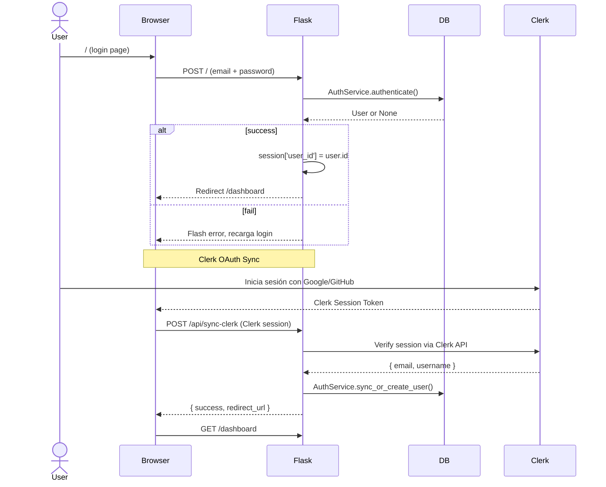
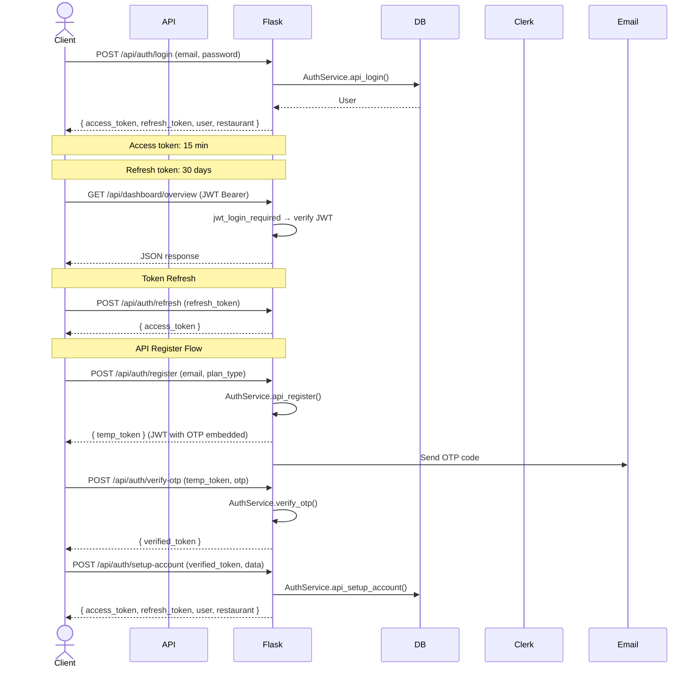
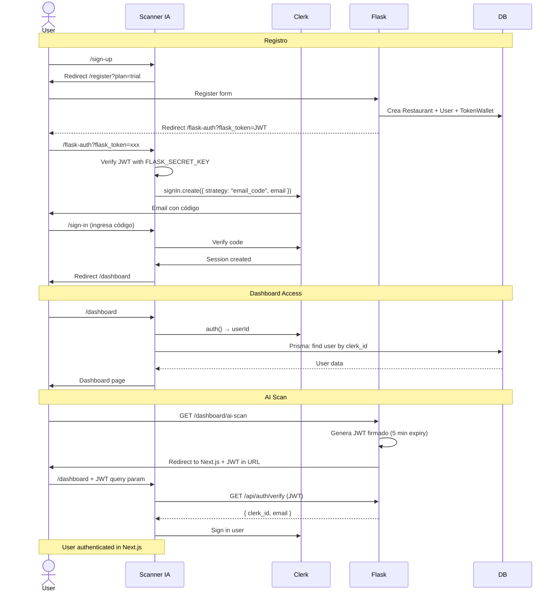
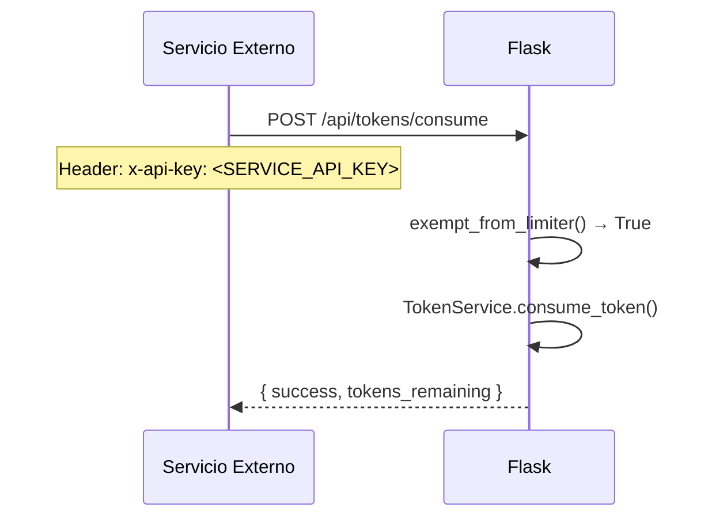

# Flujo de Autenticación — Velzia

> **Componentes:** Clerk OAuth + Flask Session + JWT + API Key

## Diagrama General

```mermaid
graph TD
    subgraph "Métodos de Autenticación"
        W[Web Browser] -->|Session Cookie| S[Flask Session]
        M[Mobile/API] -->|JWT Bearer| J[JWT Auth]
        N[Scanner IA] -->|Clerk Session| C[Clerk]
        S2[Server-to-Server] -->|x-api-key| K[API Key]
    end

    subgraph "Flask Decorators"
        S --> L[login_required]
        J --> JL[jwt_login_required]
        K --> KT[/api/tokens/* bypass]
    end

    L --> A[active_required]
    JL --> JA[jwt_active_required]
    A --> F[feature_required]
    JA --> JF[jwt_feature_required]
    
    L & J --> FL[flexible_login_required<br/>accepts both]
```

## 1. Web (Session) — Login Tradicional



## 2. API (JWT) — Login Mobile



## 3. Scanner IA — Clerk + Flask Bridge



## 4. Server-to-Server (API Key)



## 5. Decoradores — Referencia Rápida

| Decorador | Auth | Uso | Respuesta si falla |
|-----------|------|-----|-------------------|
| `@login_required` | Session | Web routes | Redirect a `/` o JSON 401 |
| `@active_required` | Session | Verifica restaurante activo + suscripción | Flash error o JSON 403 |
| `@feature_required('feature')` | Session | Verifica feature del plan | Flash o JSON 403 |
| `@jwt_login_required` | JWT | API routes | JSON 401 |
| `@jwt_active_required` | JWT | API: verifica activo + suscripción | JSON 403 |
| `@jwt_feature_required('feature')` | JWT | API: verifica feature del plan | JSON 403 |
| `@flexible_login_required` | JWT o Session | API categories (dual) | JSON 401 |
| `@flexible_active_required` | JWT o Session | API: activo + suscripción | JSON 403 |

### Orden de aplicación correcta:
```python
# Web
@login_required
@active_required
@feature_required('has_modifiers')
def create_modifier(): ...

# API
@jwt_login_required
@jwt_active_required
@jwt_feature_required('has_table_qr')
def create_table(): ...
```

## 6. JWT Structure

### Access Token (15 min)
```json
{
  "sub": "<user_id>",
  "restaurant_id": "<int>",
  "clerk_id": "<string>",
  "type": "access",
  "iat": 1234567890,
  "exp": 1234568790
}
```

### Refresh Token (30 days)
```json
{
  "sub": "<user_id>",
  "type": "refresh",
  "jti": "<uuid>",
  "iat": 1234567890,
  "exp": 1234567890 + 30d
}
```

### Flask → Next.js Bridge Token (5 min)
```json
{
  "clerk_id": "<string>",
  "user_id": "<int>",
  "email": "<email>",
  "type": "flask_auth",
  "iat": 1234567890,
  "exp": 1234567890 + 300
}
```

## 7. CSRF Protection

| Tipo de Ruta | CSRF | Método |
|-------------|------|--------|
| Web forms (`/dashboard/*`, `/categories/*`, etc.) | ✅ Requerido | Token via `{{ csrf_token() }}` |
| API routes (`/api/*`) | ❌ Exento | `before_request` hook |
| Webhooks (`/webhook`) | ❌ Exento | `@csrf.exempt` |
| Token consume/topup | ❌ Exento | `@csrf.exempt` |

---

*Documento mantenido en /docs/AUTH_FLOW.md*
