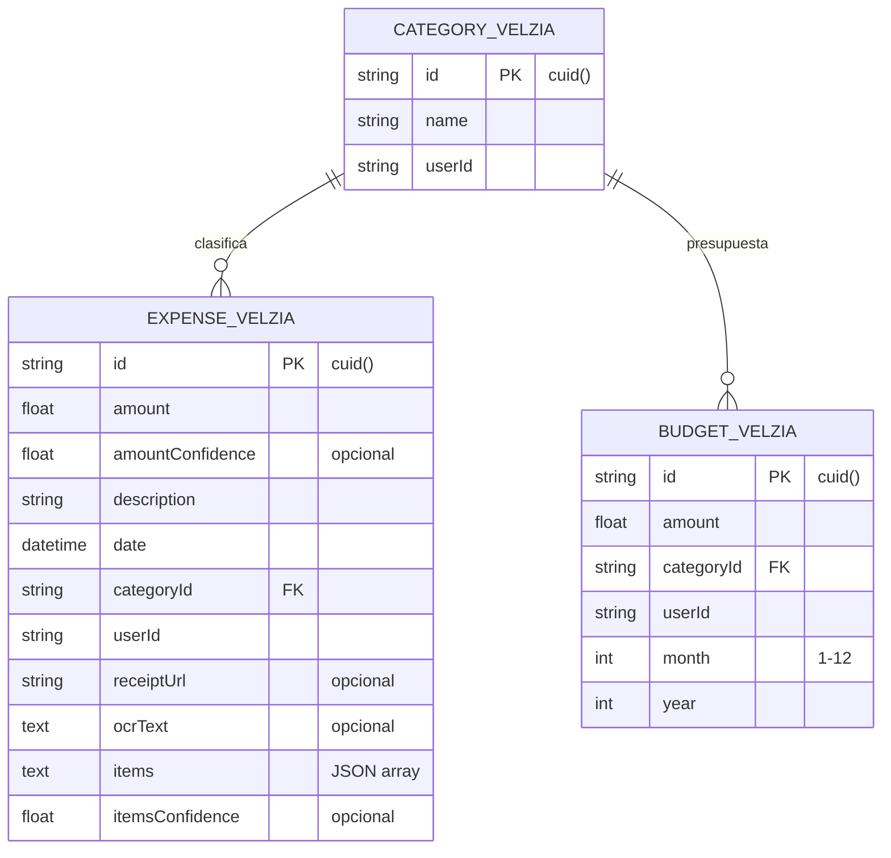

# Base de Datos — Velzia

> **Motor:** MySQL 8 | **ORM:** SQLAlchemy (Flask) + Prisma (Next.js) | **Base compartida:** `orderfox`

## Modelo Entidad-Relación

### Diagrama General

```mermaid
erDiagram
    RESTAURANT ||--o{ USER : tiene
    RESTAURANT ||--o{ CATEGORY : tiene
    RESTAURANT ||--o{ PRODUCT : tiene
    RESTAURANT ||--o{ MODIFIER : tiene
    RESTAURANT ||--o{ ORDER : tiene
    RESTAURANT ||--o{ TABLE : tiene
    RESTAURANT ||--o{ ORDER_ITEM : contiene
    RESTAURANT ||--o{ EXPENSE : registra

    CATEGORY ||--o{ PRODUCT : agrupa
    PRODUCT ||--o{ MODIFIER : tiene
    
    TABLE ||--o{ ORDER : referencia
    
    ORDER ||--o{ ORDER_ITEM : contiene
    
    USER ||--o| AI_TOKEN_WALLET : posee
    USER ||--o{ AI_TOKEN_TRANSACTION : genera

    CATEGORY_VELZIA ||--o{ EXPENSE_VELZIA : clasifica
    CATEGORY_VELZIA ||--o{ BUDGET_VELZIA : tiene

    RESTAURANT {
        int id PK
        string name
        string slug UK
        string whatsapp_phone
        string plan_type
        datetime subscription_expires_at
        boolean is_active
        boolean is_open
        boolean has_used_trial
        int pending_expiry_hours
    }

    USER {
        int id PK
        int restaurant_id FK
        string username
        string email UK
        string password
        string clerk_id UK
    }

    CATEGORY {
        int id PK
        int restaurant_id FK
        string name
        text description
        int sort_order
        boolean is_active
        string image_url
    }

    PRODUCT {
        int id PK
        int restaurant_id FK
        int category_id FK
        string name
        int price
        boolean is_active
        string image_url
        text description
    }

    ORDER {
        int id PK
        int restaurant_id FK
        int table_id FK
        string order_number
        string customer_name
        string status
        int total
        string ip_address
        datetime expires_at
    }

    AI_TOKEN_WALLET {
        int id PK
        int user_id FK UK
        int plan_limit
        int plan_tokens
        int extra_tokens
        int tokens_used_month
        datetime reset_at
    }
```

### Tablas Legacy (Orderfox — Pedidos)

#### `restaurants` — Tenant principal
| Campo | Tipo | Notas |
|-------|------|-------|
| `id` | INT PK | |
| `name` | VARCHAR(100) | Nombre del restaurante |
| `slug` | VARCHAR(50) UNIQUE | Identificador URL (ej: `pizza-lima`) |
| `whatsapp_phone` | VARCHAR(20) | Teléfono de contacto |
| `plan_type` | VARCHAR(20) | `trial`, `emprendedor`, `crecimiento`, `elite` |
| `subscription_expires_at` | DATETIME (UTC) | Null = sin suscripción activa |
| `is_active` | BOOLEAN | `False` = cuenta marcada para borrar |
| `is_open` | BOOLEAN | Abierto/cerrado para pedidos |
| `has_used_trial` | BOOLEAN | Ya usó el trial |
| `pending_expiry_hours` | INT | Default 24h para expirar pedidos |
| `created_at` | DATETIME (UTC) | |

#### `users` — Usuarios del sistema
| Campo | Tipo | Notas |
|-------|------|-------|
| `id` | INT PK | |
| `restaurant_id` | INT FK | FK → `restaurants.id` CASCADE |
| `username` | VARCHAR(80) | |
| `email` | VARCHAR(120) UNIQUE | |
| `password` | VARCHAR(255) | Hash |
| `clerk_id` | VARCHAR(100) UNIQUE | ID de Clerk OAuth |

#### `categories` — Categorías del menú
| Campo | Tipo | Notas |
|-------|------|-------|
| `id` | INT PK | |
| `restaurant_id` | INT FK | FK → `restaurants.id` CASCADE |
| `name` | VARCHAR(100) | |
| `description` | TEXT | |
| `sort_order` | INT | Orden de visualización |
| `is_active` | BOOLEAN | |
| `image_url` | VARCHAR(255) | Cloudinary URL |
| `created_at` / `updated_at` | DATETIME | |

#### `products` — Productos del menú
| Campo | Tipo | Notas |
|-------|------|-------|
| `id` | INT PK | |
| `restaurant_id` | INT FK | FK → `restaurants.id` CASCADE |
| `category_id` | INT FK | FK → `categories.id` CASCADE |
| `name` | VARCHAR(100) | |
| `description` | TEXT | |
| `price` | INT | En COP |
| `is_active` | BOOLEAN | |
| `image_url` | VARCHAR(255) | |

#### `modifiers` — Modificadores de productos
| Campo | Tipo | Notas |
|-------|------|-------|
| `id` | INT PK | |
| `restaurant_id` | INT FK | FK → `restaurants.id` CASCADE |
| `product_id` | INT FK | FK → `products.id` CASCADE |
| `name` | VARCHAR(50) | Ej: "Sin cebolla", "Extra queso" |
| `extra_price` | INT | Precio adicional en COP |
| `is_active` | BOOLEAN | |

#### `orders` — Pedidos
| Campo | Tipo | Notas |
|-------|------|-------|
| `id` | INT PK | |
| `restaurant_id` | INT FK | FK → `restaurants.id` CASCADE |
| `table_id` | INT FK | FK → `tables.id` SET NULL |
| `order_number` | VARCHAR(20) | Formato: `ORD-001` |
| `customer_name` | VARCHAR(100) | |
| `customer_phone` | VARCHAR(20) | |
| `status` | VARCHAR(20) | `pending` → `confirmed` → `delivered` |
| `total` | INT | En COP |
| `notes` | TEXT | |
| `ip_address` | VARCHAR(45) | Para rate limiting |
| `expires_at` | DATETIME | Auto-expira si no se confirma |

**Máquina de estados de pedidos:**
```
pending ──► confirmed ──► delivered
  │              │
  ▼              ▼
cancelled     cancelled
  │
  ▼
pending (se puede reactivar)
```

#### `order_items` — Items del pedido
| Campo | Tipo | Notas |
|-------|------|-------|
| `id` | INT PK | |
| `order_id` | INT FK | FK → `orders.id` CASCADE |
| `product_name` | VARCHAR(100) | Snapshot del nombre |
| `product_price` | INT | Snapshot del precio |
| `quantity` | INT | |
| `modifiers_snapshot` | TEXT | JSON con modificadores elegidos |
| `subtotal` | INT | price × quantity |

#### `order_counters` — Contadores atómicos para order_number
| Campo | Tipo | Notas |
|-------|------|-------|
| `id` | INT PK | |
| `restaurant_id` | INT FK | |
| `date` | DATE | |
| `counter` | INT | Se incrementa con `FOR UPDATE` |

**UK:** `(restaurant_id, date)`

#### `tables` — Mesas del restaurante
| Campo | Tipo | Notas |
|-------|------|-------|
| `id` | INT PK | |
| `restaurant_id` | INT FK | |
| `name` | VARCHAR(50) | |
| `qr_code` | VARCHAR(255) | QR generado |
| `is_active` | BOOLEAN | |

### Tablas de Token AI

#### `ai_token_wallets` — Billetera de tokens por usuario
| Campo | Tipo | Notas |
|-------|------|-------|
| `id` | INT PK | |
| `user_id` | INT FK UNIQUE | Un wallet por usuario |
| `plan_limit` | INT NULL | NULL = Elite (ilimitado) |
| `plan_tokens` | INT | Tokens restantes del plan |
| `extra_tokens` | INT | Tokens comprados extra |
| `tokens_used_month` | INT | Usados este mes |
| `reset_at` | DATETIME | Reset mensual |

#### `ai_token_transactions` — Log de transacciones
| Campo | Tipo | Notas |
|-------|------|-------|
| `id` | INT PK | |
| `user_id` | INT FK | |
| `type` | VARCHAR(20) | `consume`, `topup_plan`, `topup_purchase`, `elite_scan` |
| `amount` | INT | Positivo = recarga, negativo = consumo |
| `source` | VARCHAR(50) | `scanner_ia`, `plan_renewal`, `mp_purchase`, etc. |
| `mp_payment_id` | VARCHAR(100) | ID de Mercado Pago (para idempotencia) |
| `description` | VARCHAR(200) | |
| `created_at` | DATETIME | |

### Tablas Velzia (Scanner IA — Gastos)

> Prefijo: `velzia_` (mapeado via `@@map` en Prisma)

#### `velzia_category` — Categorías de gastos del usuario
| Campo | Tipo | Notas |
|-------|------|-------|
| `id` | CUID PK | |
| `name` | VARCHAR | Nombre de categoría |
| `userId` | VARCHAR | Clerk user ID |
| `createdAt` / `updatedAt` | DATETIME | |

**UK:** `(name, userId)`

#### `velzia_expense` — Gastos registrados
| Campo | Tipo | Notas |
|-------|------|-------|
| `id` | CUID PK | |
| `amount` | FLOAT | Monto total |
| `amountConfidence` | FLOAT NULL | 0.0–1.0 |
| `description` | TEXT | Comercio/descripción |
| `date` | DATETIME | Fecha del gasto |
| `categoryId` | CUID FK | FK → `velzia_category.id` |
| `userId` | VARCHAR | Clerk user ID |
| `receiptUrl` | VARCHAR | Ruta a imagen del ticket |
| `ocrText` | TEXT | Texto extraído por OCR |
| `items` | TEXT | JSON array: `[{name, price}]` |
| `itemsConfidence` | FLOAT NULL | 0.0–1.0 |

#### `velzia_budget` — Presupuestos mensuales
| Campo | Tipo | Notas |
|-------|------|-------|
| `id` | CUID PK | |
| `amount` | FLOAT | Presupuesto asignado |
| `categoryId` | CUID FK | FK → `velzia_category.id` |
| `userId` | VARCHAR | Clerk user ID |
| `month` | INT | 1–12 |
| `year` | INT | |

**UK:** `(categoryId, month, year)`

### Diagrama de Tablas Velzia



## Migraciones

| Proyecto | Herramienta | Comando |
|----------|------------|---------|
| **Flask** | Alembic (Flask-Migrate) | `flask db migrate -m "msg"` / `flask db upgrade` |
| **Next.js** | Prisma Migrate | `npx prisma migrate dev --name desc` |

## Convenciones

- **Todo en UTC**: Todos los campos DATETIME almacenan/ comparan en UTC
- **Tipo `AwareDateTime`**: Decorator en Flask que quita timezone al escribir y lo agrega al leer
- **CUID vs AUTO_INCREMENT**: Tablas nuevas (Velzia) usan CUID; tablas legacy usan autoincrement
- **Cascade deletes**: Restaurant → todo cascade; Table → orders SET NULL

---

*Documento mantenido en /docs/DATABASE.md*
