# Arquitectura Frontend — Velzia

> **Stack:** Vanilla JS + Jinja2 (Flask) + React 19 (Next.js) + Tailwind CSS v4

## Ordenfox (Flask) — Frontend Clásico

### Estructura de Archivos JS

```
app/static/js/
├── public/                  # Módulos del menú público (QR)
│   ├── cart-core.js         # Lógica de carrito + localStorage
│   ├── checkout.js          # Address modal, processOrder, success
│   ├── detail-panel.js      # Panel detalle producto + modificadores
│   ├── interactions.js      # Interacciones del menú 3-panel
│   └── menu-public.js       # ORQUESTADOR (147 líneas, antes 657)
├── api-client.js            # [REFACTOR] Fetch wrapper unificado
├── toast.js                 # [REFACTOR] Sistema de notificaciones
├── event-delegation.js      # [REFACTOR] Event delegation centralizado
├── image-preview.js         # [REFACTOR] Preview de imágenes
├── auth-common.js           # Auth: monkeypatch CSRF, showToast legacy
├── cart.js                  # Carrito legacy (public_base.html)
├── categories.js            # Toggle categorías
├── categories-dashboard.js  # CRUD dashboard categorías
├── dashboard.js             # Stats, gráficos, polling pedidos
├── global-search.js         # Búsqueda global productos
├── modal-delete.js          # Modal de eliminación
├── modifiers-modal.js       # CRUD modificadores
├── order-detail-panel.js    # Panel lateral detalle pedido
├── orders-realtime.js       # Polling + BroadcastChannel + sonidos
├── orders.js                # Filtros y toggle lista pedidos
├── order_create.js          # Crear pedido manual
├── order_detail.js          # Detalle pedido con actualización
├── products.js              # Toggle productos
├── products-dashboard.js    # Búsqueda + paginación productos
├── qr_pages.js              # Descarga de códigos QR
├── subscription.js          # Gestión suscripción
├── token-wheel.js           # Indicador de tokens AI
├── tailwind.app.js          # Tailwind config dashboard
└── tailwind.login.js        # Tailwind config login
```

### Mapa de Dependencias JS

```mermaid
graph TD
    subgraph "Dashboard Pages"
        DB[dashboard.html] --> DJ[dashboard.js]
        DB --> OR[orders-realtime.js]
        DB --> TW[tailwind.app.js]
        
        PR[products.html] --> PJ[products.js]
        PR --> PD[products-dashboard.js]
        PR --> MM[modifiers-modal.js]
        PR --> IP[image-preview.js]
        
        CT[categories.html] --> CJ[categories.js]
        CT --> CD[categories-dashboard.js]
        
        OD[orders.html] --> OJ[orders.js]
        OD --> OR
        OD --> ODJ[order_detail.js]
        
        TB[tables.html] --> QR[qr_pages.js]
        
        SB[subscription.html] --> SJ[subscription.js]
        
        ST[settings.html] --> MD[modal-delete.js]
    end

    subgraph "Shared Modules"
        AC[api-client.js]
        TT[toast.js]
        ED[event-delegation.js]
        IP[image-preview.js]
    end

    subgraph "Public Menu"
        MP[menu_public.html] --> MC[public/cart-core.js]
        MP --> MX[public/checkout.js]
        MP --> MD[public/detail-panel.js]
        MP --> MI[public/interactions.js]
        MP --> MU[public/menu-public.js]
    end

    subgraph "Auth Pages"
        AL[auth/index.html] --> AC[auth-common.js]
        AL --> TW
    end

    DJ --> AC
    DJ --> TT
    PJ --> AC
    PJ --> TT
    MM --> AC
    OR --> TT
```



### Template Hierarchy

```
template/
├── common/
│   └── base.html                  # ← Layout principal (sidebar, header, scripts)
│
├── public_base.html               # ← Layout público (sin sidebar, carrito flotante)
│
├── dashboard/
│   ├── index.html                 # Dashboard principal (extends base)
│   ├── productos.html             # Gestión productos (extends base)
│   ├── categories.html            # Categorías (extends base)
│   ├── orders.html                # Pedidos (extends base)
│   ├── order_detail.html          # Detalle pedido (extends base)
│   ├── order_create.html          # Crear pedido (extends base)
│   ├── tables.html                # Mesas (extends base)
│   ├── subscription.html          # Suscripción (extends base)
│   ├── settings.html              # Configuración (extends base)
│   ├── profile_form.html          # Perfil (extends settings_layout)
│   ├── qr_page.html               # QR (extends base)
│   ├── product_form.html          # Form producto
│   ├── category_form.html         # Form categoría
│   ├── products_category.html     # Productos por categoría
│   ├── legal.html                 # Términos legales
│   └── ai_scan_redirect.html      # Redirect a Scanner IA
│
├── public/
│   ├── menu_public.html           # Menú 3-panel (NO extiende public_base)
│   ├── menu_novedades.html        # Novedades
│   ├── menu_category_products.html # Productos por categoría
│   ├── store_closed.html          # Restaurante cerrado
│   └── footer.html                # Footer público
│
└── auth/
    ├── index.html                 # Login
    ├── register_verify.html       # Registro paso 1
    ├── register_setup.html        # Setup cuenta
    ├── plans.html                 # Planes
    ├── payment.html               # Pago MP
    ├── forgot_password.html       # Olvidé contraseña
    ├── reset_password.html        # Reset contraseña
    ├── logout_clerk.html          # Logout
    └── sync_clerk.html            # Sync Clerk
```

### Global Context (inyectado en TODOS los templates)

```python
# Desde app/__init__.py → inject_global_data()
{
  'SUPPORT_PHONE': '+573000000000',
  'SUPPORT_EMAIL': 'soporte@velzia.com',
  'SCANNER_IA_URL': 'http://localhost:3000',
  'sub_status': { 'is_active': True, 'status': 'active', 'can_crud': True, ... },
  'user': <User object>,
  'is_admin': True,
  'restaurant': <Restaurant object>,
  'get_image_url': <function>  # Template global
}
```

### Patrón de Fetch (post-refactor)

```javascript
// api-client.js — Fetch wrapper unificado
window.api = {
  async request(url, options = {}) {
    const csrfToken = document.querySelector('meta[name="csrf-token"]')?.content;
    const headers = { 'X-Requested-With': 'XMLHttpRequest', ...options.headers };
    if (csrfToken) headers['X-CSRFToken'] = csrfToken;
    
    const res = await fetch(url, { ...options, headers });
    if (!res.ok) throw new Error(`HTTP ${res.status}`);
    return res.json();
  },
  
  get(url) { return this.request(url); },
  post(url, data) { return this.request(url, { method: 'POST', body: data }); },
  patch(url, data) { return this.request(url, { method: 'PATCH', body: JSON.stringify(data), headers: { 'Content-Type': 'application/json' } }); },
  delete(url) { return this.request(url, { method: 'DELETE' }); }
};
```

### Patrón de Toast (post-refactor)

```javascript
// toast.js — Notificaciones unificadas
window.showToast = (message, type = 'info', duration = 3000) => {
  // type: 'success' (verde), 'error' (rojo), 'info' (azul), 'warning' (naranja)
  // Crea, muestra y auto-destruye el toast con animación
};
```

### Patrón de Event Delegation (post-refactor)

```javascript
// event-delegation.js
document.addEventListener('click', (e) => {
  const action = e.target.closest('[data-action]');
  if (!action) return;
  
  switch (action.dataset.action) {
    case 'toggle-product': handleToggleProduct(action.dataset.id); break;
    case 'delete-category': handleDeleteCategory(action.dataset.id); break;
    case 'open-modal': handleOpenModal(action.dataset.modal, action.dataset); break;
    // ...
  }
});
```

## Scanner IA (Next.js) — Frontend React

### Component Tree

```
layout.tsx (ClerkProvider + fonts)
└── LandingPage (page.tsx)
    └── LandingHeader
        └── ClerkUserButton

dashboard/layout.tsx (sidebar + mobile nav)
└── dashboard/page.tsx (data fetching → props)
    └── DashboardContent (client component)
        ├── StatCard × 3
        ├── ChartsSection
        │   ├── CategoryDonutChart (SVG)
        │   ├── MonthlyTrendChart (SVG)
        │   └── DailySpendingChart (SVG)
        ├── ReceiptScanner
        │   ├── ScannerIdle
        │   ├── ScannerPreview
        │   ├── ScannerAnalyzing
        │   └── ScannerReview
        ├── RecentExpensesList
        ├── TokenBubble (sidebar)
        └── TokenRechargeModal

dashboard/categories/page.tsx
└── CategoriesWrapper
    ├── CategoryForm
    └── CategoryCard × N
        └── DeleteModal

dashboard/activity/page.tsx
└── RecentActivityClient
    ├── SearchAndFilterBar
    ├── ExpenseCard × N
    ├── Pagination
    └── EditExpenseModal
        ├── ReceiptImageViewer
        ├── ItemListEditor
        └── DeleteConfirmationOverlay
```

### Estilos Globales (Tailwind v4 + CSS custom)

```css
/* Variables de diseño */
:root {
  --bg-obsidian: #050505;
  --accent-orange: #f97316;
  --surface-glass: rgba(255,255,255,0.03);
  --border-glass: rgba(255,255,255,0.1);
}

/* Componentes reutilizables */
.obsidian-card { /* Glass card con gradiente */ }
.btn-primary { /* Botón blanco → naranja hover */ }
.btn-accent { /* Botón naranja con glow */ }
.badge-orange / .badge-emerald / .badge-ruby { /* Badges */ }
.skeleton { /* Loading shimmer */ }
```

### Temas Oscuro/Claro

- **Flask:** Usa `prefers-color-scheme` CSS + clases condicionales
- **Next.js:** Tema oscuro fijo (`#050505` fondo), sin toggle
- **Tailwind v4:** Sin dark: prefix — todo es dark-first

---

*Documento mantenido en /docs/FRONTEND_ARCH.md*
