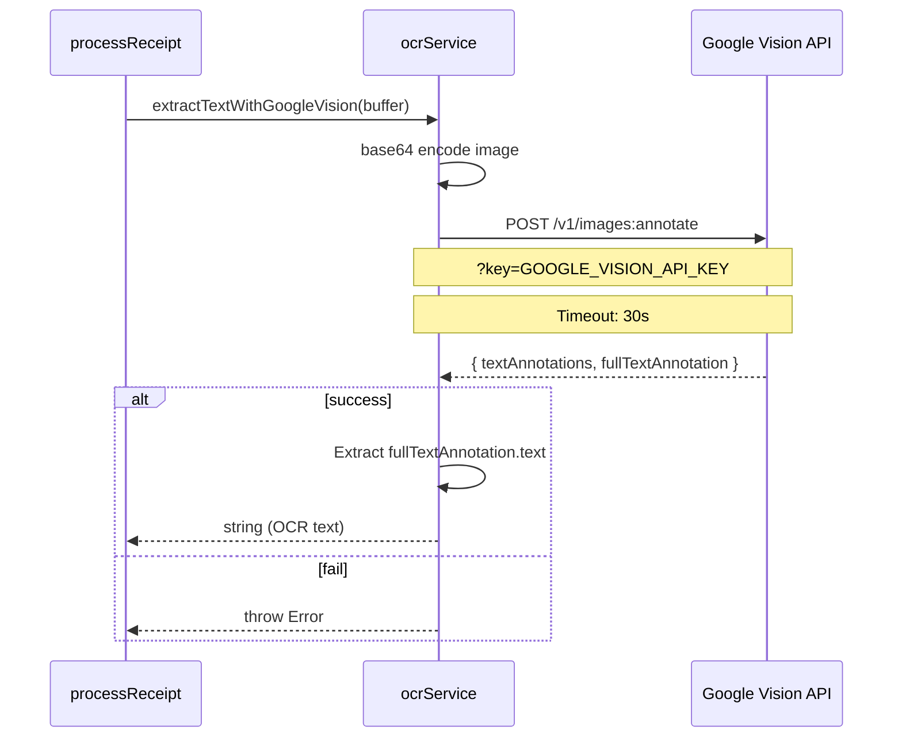
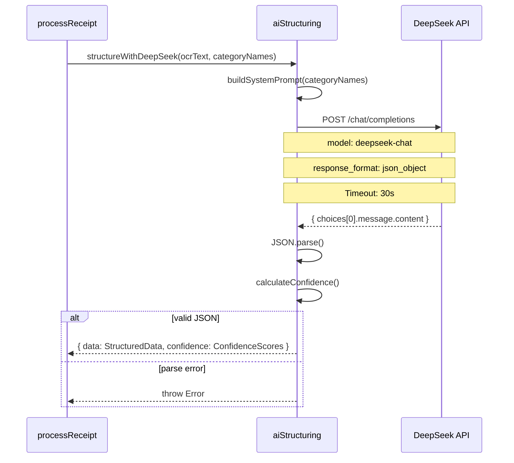
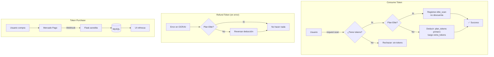
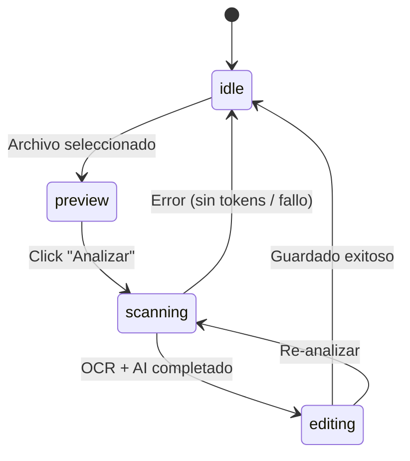

# Scanner IA — Pipeline de Escaneo de Gastos

> **App:** Receipt-Scanner-AI (Next.js 15)  
> **Propósito:** Escanear tickets/recibos con IA, extraer datos estructurados y categorizar gastos

## Diagrama del Pipeline

```mermaid
graph TD
    subgraph "Usuario"
        U[Sube foto del ticket]
    end

    subgraph "Server Actions (Next.js)"
        TK[consumeToken<br/>-1 token]
        GV[Google Vision OCR<br/>extrae texto bruto]
        DS[DeepSeek AI<br/>estructura datos]
        CF[calculateConfidence<br/>asigna confianza]
        SV[saveExpense<br/>guarda en DB]
    end

    subgraph "UI Components"
        ID[ScannerIdle<br/>upload screen]
        PR[ScannerPreview<br/>vista previa]
        SC[ScannerAnalyzing<br/>analizando...]
        RV[ScannerReview<br/>editar/confirmar]
        ST[StatusModal<br/>éxito/error]
    end

    U --> ID
    ID -->|selecciona archivo| PR
    PR -->|click "Analizar"| SC
    SC -->|processReceipt()| TK
    TK -->|ok| GV
    GV -->|texto bruto| DS
    DS -->|datos estructurados| CF
    CF -->|resultado + confianza| RV
    RV -->|click "Guardar"| SV
    SV --> ST

    TK -->|sin tokens| ERR[StatusModal error]
    GV -->|falla| RF[refundToken]
    DS -->|falla| RF
```

## Pipeline Completo (`src/actions/ocr.ts`)

```typescript
export async function processReceipt(formData: FormData): Promise<OCRResult> {
  // 1. Auth
  const { userId } = await auth();
  
  // 2. Consume token
  await consumeToken(userId);
  
  // 3. Extract file
  const file = formData.get('file') as File;
  const buffer = Buffer.from(await file.arrayBuffer());
  
  // 4. Save image locally
  const ext = file.name.split('.').pop();
  const filename = `${crypto.randomUUID()}.${ext}`;
  const filepath = path.join(process.cwd(), 'public', 'uploads', filename);
  fs.mkdirSync(path.dirname(filepath), { recursive: true });
  fs.writeFileSync(filepath, buffer);
  
  // 5. Google Vision OCR
  const ocrText = await extractTextWithGoogleVision(buffer);
  
  // 6. Get user's existing categories
  const categoryNames = await getCategoriesForUser(userId);
  
  // 7. DeepSeek AI structuring
  const { data, confidence } = await structureWithDeepSeek(ocrText, categoryNames);
  
  // 8. Return result
  return {
    amount: data.amount,
    amountConfidence: confidence.amountConfidence,
    merchant: data.merchant,
    date: data.date,
    category: data.category,
    description: data.description,
    ocrText,
    imageUrl: `/uploads/${filename}`,
    items: data.items,
    itemsConfidence: confidence.itemsConfidence,
  };
}
```

## Google Vision OCR (`src/actions/services/ocrService.ts`)



**Request:**
```json
{
  "requests": [{
    "image": { "content": "<base64>" },
    "features": [{ "type": "TEXT_DETECTION" }]
  }]
}
```

**Timeout:** 30 segundos via `AbortSignal.timeout(30000)`

## DeepSeek AI Structuring (`src/actions/services/aiStructuring.ts`)



**System Prompt** (generado dinámicamente):
```
You are a receipt parser. Extract structured data from the following OCR text.

If the categories provided exist, PICK THE CLOSEST MATCHING CATEGORY from this list: [lista de categorías del usuario].
If no categories match or the list is empty, use "Otros" as the default.

Return a JSON object with this structure:
{
  "amount": <float: total amount>,
  "items": [{"name": <string>, "price": <float>}],
  "merchant": <string: store/business name>,
  "date": <string: YYYY-MM-DD>,
  "category": <string>,
  "description": <string>
}
```

### Cálculo de Confianza

```typescript
function calculateConfidence(data: StructuredData): ConfidenceScores {
  let amountConfidence = 0.7;  // base: no items extracted
  
  if (data.items.length > 0) {
    const itemsSum = data.items.reduce((sum, item) => sum + item.price, 0);
    const diff = Math.abs(itemsSum - data.amount);
    
    if (itemsSum > 0) {
      const percentDiff = diff / data.amount;
      if (percentDiff <= 0.01) amountConfidence = 1.0;
      else if (percentDiff <= 0.05) amountConfidence = 0.8;
      else amountConfidence = 0.5;
    }
  }
  
  const itemsConfidence = data.items.length > 0
    ? (Math.abs(data.items.reduce((s, i) => s + i.price, 0) - data.amount) / data.amount <= 0.01 ? 1.0
      : Math.abs(data.items.reduce((s, i) => s + i.price, 0) - data.amount) / data.amount <= 0.05 ? 0.8
      : 0.5)
    : 0.5;
  
  return { amountConfidence, itemsConfidence };
}
```

## Sistema de Tokens (`src/actions/services/tokenService.ts`)



**Límites por plan:**
| Plan | Tokens/mes |
|------|-----------|
| Trial | 10 |
| Emprendedor | 150 |
| Crecimiento | 500 |
| Elite | Ilimitado |

**Packs de recarga:**
| Pack | Precio | Tokens | Marca |
|------|--------|--------|-------|
| Básico | $5,000 COP | 15 | Starter |
| Pro | $10,000 COP | 35 | Popular |

## Componentes UI del Scanner

### Estados del Scanner



### `ReceiptScanner.tsx` — Orquestador
- Props: none (usa `useSearchParams` para `?action=scan`)
- Maneja los 4 estados (idle, preview, scanning, editing)
- Llama `processReceipt()` → `saveExpense()`

### `ScannerIdle.tsx` — Pantalla de inicio
- Icono de cámara grande
- Botón de subir foto (`accept="image/*" capture="environment"`)
- Texto: "Toma una foto o selecciona un archivo"

### `ScannerPreview.tsx` — Vista previa
- Muestra la imagen seleccionada
- Botones: "Repetir Foto" / "Analizar con IA"

### `ScannerAnalyzing.tsx` — Analizando
- Animación de anillo giratorio
- Barra de progreso animada
- Textos de estado: "Conectando con OCR..." → "Analizando texto..." → "Extrayendo datos..." → "Calculando..."

### `ScannerReview.tsx` — Revisión/edición
- Formulario editable con:
  - Comercio (input)
  - Monto total (input, readonly si hay items)
  - Categoría (dropdown)
  - Fecha (date picker)
  - Lista de items (name + price, editable)
  - Diferencia items vs total (indicador visual)
- Botón: "Confirmar y Guardar Registro"

## Data Flow

```
User uploads image → processReceipt() Server Action
  → consumeToken() → Google Vision OCR → DeepSeek AI
  → confidence scoring → returns OCRResult to client
  → User reviews/edits → saveExpense() Server Action
    → findOrCreateCategory → prisma.expense.create()
    → revalidatePath('/dashboard') → UI refreshes
```

---

*Documento mantenido en /docs/SCANNER_IA.md*
